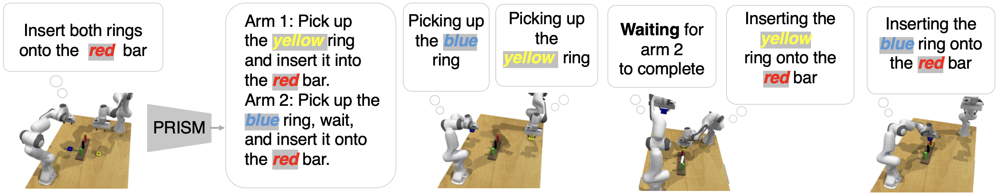
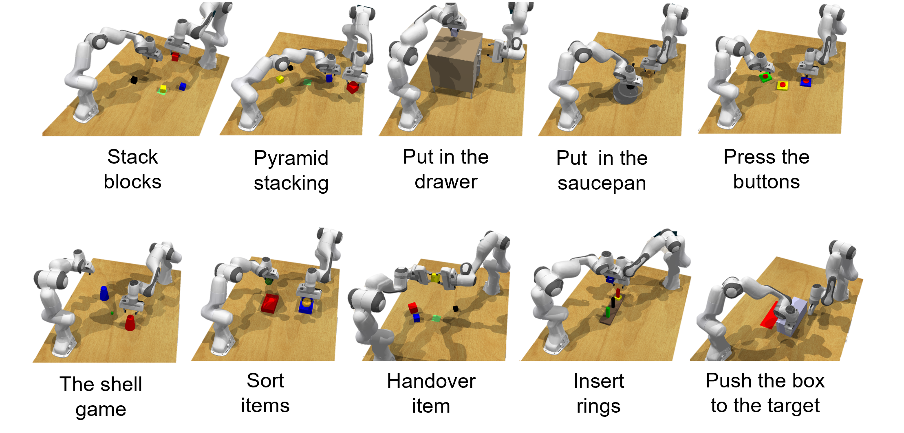
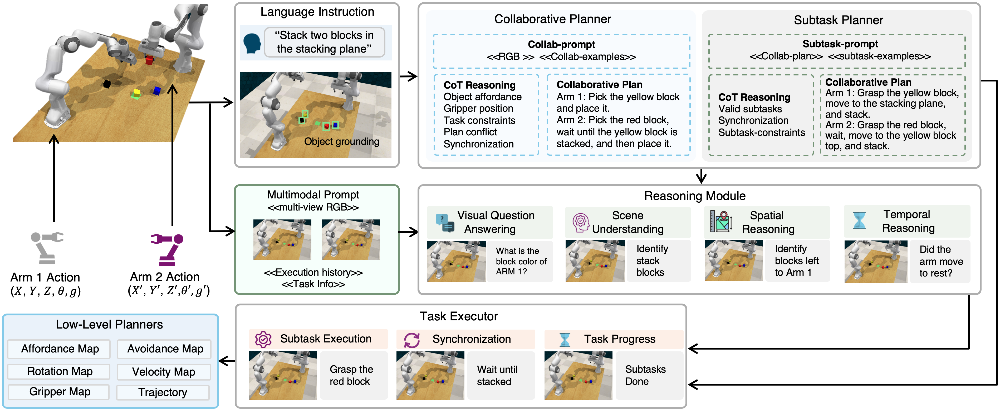
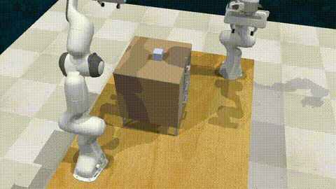
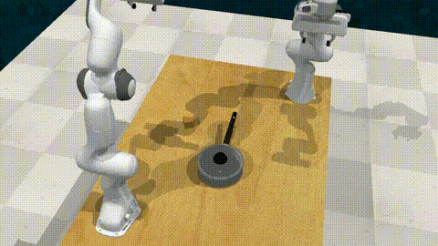
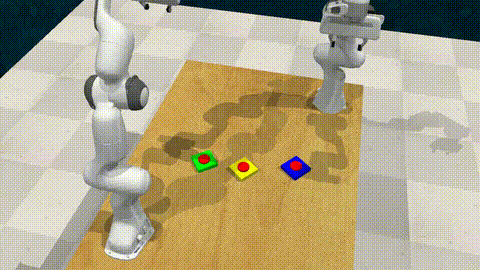
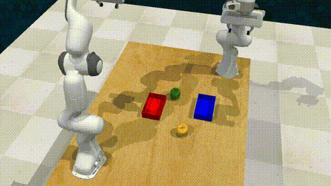

[**Website**](https://github.com/aaai2026-review/preference-aware/)
| [**Code**](https://github.com/aaai2026-review/preference-aware/tree/main/Code/)
| [**Story Dataset**](https://github.com/aaai2026-review/preference-aware/tree/main/story_dataset/)

## A Vision-Language Architecture for Hierarchical Multi-Agent Coordination

  

Multi‑agent systems hold the promise of distributed, parallel execution in domains ranging from manufacturing to assistive care. However, enabling multiple agents to follow natural language instructions in dynamic environments remains a challenging problem due to the lack of mechanisms for grounding language into temporally synchronized, vision-aware action plans. To overcome these limitations and enable robust coordination among multiple agents, we present a hierarchical vision-language framework that grounds natural language instructions into synchronized multi-agent workflows by dynamically injecting synchronization constraints via predicate reasoning over multimodal observations and execution history. Additionally, to enable systematic evaluation of multi-agent coordination, we introduce RLBench-COLLAB, an extended benchmark comprising ten two-robot manipulation tasks spanning sequential coordination, parallel coordination, coupled interaction, and behavior-aware reasoning. Our extensive experiments suggest that the proposed method significantly outperforms state-of-the-art planning frameworks, achieving an average task success rate of 72% and an average subtask success rate of 89%. Our comprehensive evaluation and results demonstrate that the proposed method bridges the gap between adaptability and temporal coordination in multi-agent systems, enabling scalable, real-time collaboration in dynamic, open-ended environments.

### RLBench-COLLAB Task Suite

Collaborative storytelling testbed where two humans and a robot (Sam) take turns building a story. Sam uses an MDP with LLM-based preference estimation to select reward-maximizing actions. The interface displays available words, turn order, and points to support and evaluate adaptive collaboration.

  

### PRISM Architecture

  

### Successful Task Execution Results

<table>
  <tr>
    <td align="center">
       
      Stack Blocks
    </td>
    <td align="center">
       
      Pyramid Stacking
    </td>
    <td align="center">
       
      Put into Drawer
    </td>
    <td align="center">
       
      Put into Saucepan
    </td>
    <td align="center">
       
      Push Buttons
    </td>
  </tr>
  <tr>
    <td align="center">
       
      Shell Game
    </td>
    <td align="center">
       
      Sort Items
    </td>
    <td align="center">
       
      Handover Item
    </td>
    <td align="center">
       
      Insert Ring
    </td>
    <td align="center">
       
      Push Box
    </td>
  </tr>
</table>

### Experimental Results

<i>Task Success (TS↑), #Subtasks (↑), Subtask Success (STS↑)</i>

<table align="center">
  <tr>
    <th rowspan="2">Model</th>
    <th colspan="6">Sequential Coordination</th>
    <th colspan="9">Coupled Interaction</th>
  </tr>
  <tr>
    <th colspan="3">Stack Blocks</th>
    <th colspan="3">Pyramid Stacking</th>
    <th colspan="3">Put in Saucepan</th>
    <th colspan="3">Push Box Target</th>
    <th colspan="3">Put in Drawer</th>
  </tr>
  <tr>
    <td></td>
    <td>TS</td><td>#ST</td><td>STS</td>
    <td>TS</td><td>#ST</td><td>STS</td>
    <td>TS</td><td>#ST</td><td>STS</td>
    <td>TS</td><td>#ST</td><td>STS</td>
    <td>TS</td><td>#ST</td><td>STS</td>
  </tr>
  <tr>
    <td><b>Centralized Planner (Oracle)</b></td>
    <td><b>0.80</b></td><td>10.9</td><td><b>1.00</b></td>
    <td><b>0.60</b></td><td>11.0</td><td><b>0.90</b></td>
    <td><b>0.80</b></td><td><b>8.0</b></td><td><b>0.93</b></td>
    <td><b>1.00</b></td><td><b>16.0</b></td><td><b>1.00</b></td>
    <td><b>1.00</b></td><td><b>10.0</b></td><td><b>1.00</b></td>
  </tr>
  <tr>
    <td>VoxPoser</td>
    <td>0.00</td><td>10.0</td><td>0.68</td>
    <td>0.00</td><td><b>11.8</b></td><td>0.36</td>
    <td>0.50</td><td>7.0</td><td>0.79</td>
    <td>0.00</td><td>11.2</td><td>0.76</td>
    <td>0.00</td><td>9.0</td><td>0.55</td>
  </tr>
  <tr>
    <td><b>PRISM (Ours)</b></td>
    <td><b>0.80</b></td><td><b>11.0</b></td><td>0.94</td>
    <td><b>0.60</b></td><td>11.0</td><td>0.83</td>
    <td>0.70</td><td><b>8.0</b></td><td>0.81</td>
    <td>0.70</td><td>14.0</td><td>0.72</td>
    <td>0.50</td><td>8.0</td><td>0.82</td>
  </tr>
</table>

<table align="center">
  <tr>
    <th rowspan="2">Model</th>
    <th colspan="6">Parallel Coordination</th>
    <th colspan="9">Behavior-Aware Reasoning</th>
  </tr>
  <tr>
    <th colspan="3">Sort Items</th>
    <th colspan="3">Push Buttons</th>
    <th colspan="3">Insert Rings</th>
    <th colspan="3">Shell Game</th>
    <th colspan="3">Handover Item</th>
  </tr>
  <tr>
    <td></td>
    <td>TS</td><td>#ST</td><td>STS</td>
    <td>TS</td><td>#ST</td><td>STS</td>
    <td>TS</td><td>#ST</td><td>STS</td>
    <td>TS</td><td>#ST</td><td>STS</td>
    <td>TS</td><td>#ST</td><td>STS</td>
  </tr>
  <tr>
    <td><b>Centralized Planner (Oracle)</b></td>
    <td><b>0.90</b></td><td>10.0</td><td><b>0.99</b></td>
    <td><b>1.00</b></td><td><b>8.0</b></td><td><b>1.00</b></td>
    <td><b>1.00</b></td><td>8.0</td><td><b>1.00</b></td>
    <td><b>0.90</b></td><td>9.4</td><td><b>0.98</b></td>
    <td><b>1.00</b></td><td><b>12.0</b></td><td><b>1.00</b></td>
  </tr>
  <tr>
    <td>VoxPoser</td>
    <td>0.40</td><td><b>10.2</b></td><td>0.74</td>
    <td>0.30</td><td>8.0</td><td>0.40</td>
    <td>0.00</td><td>12.8</td><td>0.13</td>
    <td>0.00</td><td><b>14.5</b></td><td>0.58</td>
    <td>0.00</td><td>10.0</td><td>0.46</td>
  </tr>
  <tr>
    <td><b>PRISM (Ours)</b></td>
    <td><b>0.90</b></td><td>10.0</td><td>0.98</td>
    <td><b>1.00</b></td><td><b>8.0</b></td><td><b>1.00</b></td>
    <td>0.60</td><td><b>15.0</b></td><td>0.95</td>
    <td>0.70</td><td>13.0</td><td>0.96</td>
    <td>0.70</td><td><b>12.0</b></td><td>0.91</td>
  </tr>
</table>

